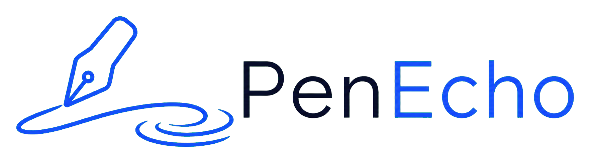
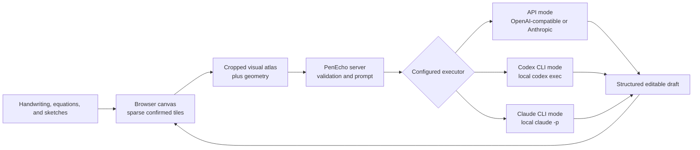

<h1 align="center">
  
</h1>

<p align="center"><strong>Think with AI beyond the chat box.</strong></p>

<p align="center">PenEcho is a shared canvas where handwriting, equations, diagrams, and spatial context become part of the conversation.</p>

<p align="center">
  <a href="https://discord.gg/3jrPJ3mXdX">
    
  </a>
</p>

<p align="center">
  
</p>

## Think on the canvas

Put a question, equation, diagram, or half-formed idea anywhere on the canvas and pause. PenEcho reads your marks and their spatial relationships, then answers beside them. You can work through a problem without translating every step into a chat message or rebuilding it with rigid diagram tools.

- Get answers, hints, explanations, continuations, formulas, plots, and diagrams directly on the canvas.
- Move, resize, accept, or discard every AI draft before it becomes part of your work.
- Draw naturally with a stylus or mouse, then pan and zoom across a sparse `20,000 x 20,000` canvas.
- Draw a freehand lasso around confirmed ink to move, resize, or recolor it locally; accepting or cancelling a selection never triggers an AI request.
- Choose Arcane, Sci-fi, or Research mode to match the kind of problem you are exploring.
- Save lightweight snapshots locally in your browser. Starting a new canvas can overwrite the current snapshot, save a new copy, or continue without saving; unconfirmed AI drafts are never included.

PenEcho keeps a small local runtime and only allocates `512 x 512` tiles where ink exists, so the huge logical canvas does not become a huge bitmap.

## How it works



The browser sends only the relevant canvas crop and geometry. The server validates the request, uses the selected executor, and returns a movable draft that stays separate from confirmed ink until you accept it.

## Quick start

You need [Node.js 18.17+](https://nodejs.org/) and one of the following: an API key, an authenticated [Codex CLI](https://developers.openai.com/codex/cli), or an authenticated [Claude Code CLI](https://code.claude.com/docs/en/overview).

```bash
npm install -g penecho
penecho configure
penecho
```

`penecho configure` opens the interactive configuration center. Its main menu contains `LLM source`, `Settings`, and `Exit`. Use the arrow keys and Enter to navigate:

- `LLM source -> Claude CLI` selects a detected, recommended, default, or manually entered model and an effort level. Opus 4.8 or newer is recommended; Sonnet and Opus 4.6 can respond but may produce weaker canvas results.
- `LLM source -> Codex CLI` selects a model and effort. GPT-5.5 or newer is required for good results, `gpt-5.6-sol` is recommended, and `xhigh` is the highest listed Codex effort.
- `LLM source -> API` selects the OpenAI-compatible or Anthropic/Claude-compatible request format, then asks for the URL, model, effort, and hidden key. Anthropic API offers `none` to disable thinking and defaults new configurations to the recommended `medium` adaptive-thinking level. Existing values are offered as defaults and a blank key keeps the saved key.
- `Settings` controls the unified model timeout, the image format sent to every model executor, request recording and retention, listening interface and port, and initial Auto AI delay. WebP is the default; PNG is also available. The delay can also be changed on the canvas.

Every LLM page ends with `Test & Save`, and PenEcho always saves before checking. Codex CLI uses a fast offline check: it verifies the executable and login, then reads `codex debug models --bundled` to confirm the selected model exists. It does not run inference, attach an image, refresh the online catalog, or consume model tokens. Claude CLI and API configuration still send one small real request to verify the selected endpoint/model settings. Whether a check passes or fails, the configuration remains saved and the UI returns to the parent menu with a clear diagnostic.

The default configuration is `~/.penecho/config.env`. API credentials are plaintext in this local file, receive owner-only permissions on POSIX systems, and are never sent to browser code. Protect it like any other credential. If `penecho` is started before this file exists, it opens the configuration center automatically in an interactive terminal.

Use a different env-style configuration file for a particular launch when needed:

```bash
penecho configure --config ./team.env
penecho --config ./team.env
```

An explicit `--config` file replaces the default global file for that command. PenEcho does not automatically read a project-directory `.env` or a package-directory `.env`.

### CLI prerequisites

Installing the Codex desktop app alone does not guarantee that a `codex` executable is available on the shell `PATH`. Install and authenticate the CLI separately before selecting Codex:

```bash
npm install -g @openai/codex@latest
hash -r
codex --version
codex login status
```

If needed, run `codex login`. Claude CLI mode similarly requires an installed and authenticated Claude Code CLI, normally through `claude auth login`.

PenEcho uses the selected CLI locally and does not need an API key for that source. Normal startup checks the executable and login without consuming model tokens. Codex `Test & Save` additionally verifies the selected model against the installed CLI's bundled catalog without making a model request; Claude `Test & Save` sends a small real request.

Canvas requests through Codex use `codex exec --json`. PenEcho returns as soon as Codex emits the final agent message and `turn.completed`; if the CLI process remains alive afterward, it is terminated and cleaned up in the background instead of delaying the canvas response.

Claude CLI requests use one isolated `claude -p` turn with tools, agents, MCP, prompt suggestions, session persistence, and other nonessential background traffic disabled. Selecting effort `none` sets `MAX_THINKING_TOKENS=0`, causing Claude Code to send `thinking.type=disabled`; because `none` is not a valid Claude CLI effort value, PenEcho also passes an internal `low` effort and per-process `--settings` override to neutralize any user-level `CLAUDE_CODE_EFFORT_LEVEL=max`. Selecting `low`, `medium`, `high`, or `max` leaves thinking enabled and applies the chosen value through both Claude's `--effort` flag and the same settings override. PenEcho incrementally validates the stream and returns as soon as Claude emits its successful final `result`; any attempted tool use aborts the request, while a CLI process that remains alive after the result is terminated and cleaned up in the background.

Transient launch overrides remain available:

```bash
penecho doctor --codex
penecho --codex --model gpt-5.6-sol --effort xhigh
penecho --claude --model opus --effort max
penecho --port 4000
```

`--model`, `--effort`, and `--port` apply only to that process and take precedence over the selected configuration file. Omit them to use the saved choice or the underlying CLI default. Other model-specific effort strings are accepted and passed through.

### Run from this source directory

Install dependencies, expose this checkout's `penecho` executable through npm, configure it, and start it through the same production entry point:

```bash
npm install
npm link
penecho configure
penecho
```

`npm link` creates the local command link; it does not publish the package. There is no separate build step and local development does not use `npm start`.

Open [http://localhost:3888](http://localhost:3888). Other devices on the same trusted LAN can use `http://<this-computer-LAN-IP>:3888`.

## Recommended model configurations

These recommendations balance answer quality against the latency of PenEcho's real canvas workload. They are based on current hands-on testing rather than synthetic benchmarks; actual response time still varies with the provider, canvas complexity, image size, and reasoning behavior.

| Model | Effort | Quality and speed | Recommended use |
| --- | --- | --- | --- |
| `claude-opus-4-8` | `medium` | Strong quality with a better latency balance | Recommended Opus default for everyday canvas work |
| `claude-opus-4-8` | `high` | Higher reasoning quality, with longer and more variable waits | Complex handwriting, mathematics, diagrams, or layout decisions where quality matters more than speed |
| Fable 5 (`claude-fable-5` or `fable`) | `medium` | Very good results; in current tests, often around half the response time of `gpt-5.6-sol` at `xhigh` | A fast, high-quality general-purpose choice |
| `gpt-5.6-terra` | `low` to `high` | Surprisingly strong and responsive; current PenEcho canvas tests produced better results than `gpt-5.6-sol` with fast response times | Recommended OpenAI option across a flexible range of quality and latency targets |
| `gpt-5.6-luna` | `xhigh` | Very good canvas results with strong response speed | A responsive quality-first option when `xhigh` reasoning is appropriate |
| `gpt-5.6-sol` | `high` | Good enough for most requests and more responsive than `xhigh` | Recommended Sol default when responsiveness matters |
| `gpt-5.6-sol` | `xhigh` | Very good results, but slower and more variable | Quality-first Sol configuration for difficult canvas tasks |

Google models have not been tested yet. Contributions are welcome: if you try Gemini or another Google model, please share the model ID, provider or executor, reasoning configuration, approximate latency, and a representative canvas example in an issue.

## Token use and cost

For a typical PenEcho canvas request, total output usage—including hidden reasoning tokens when the provider reports them—roughly follows the selected effort level:

| Effort | Typical output usage | Practical guidance |
| --- | --- | --- |
| `low` | Around `1,000` tokens | Usually enough for most everyday canvas requests |
| `medium` | Around `3,000` tokens | More reasoning headroom for recognition, mathematics, diagrams, and layout |
| `xhigh` or `max` | Around `5,000–8,000` tokens | Common for quality-first `gpt-5.6-sol` and other maximum-effort requests; expect higher latency and cost |

These are practical estimates rather than enforced PenEcho limits. Actual usage can vary substantially by model, provider, canvas complexity, and reasoning behavior. The cost example below continues to use the typical `low` case: `10,000` input tokens and `1,000` output tokens. At standard short-context API rates, that would be:

- `gpt-5.6-sol`: `10,000 x $5.00 / 1M + 1,000 x $30.00 / 1M = $0.080`
- `gpt-5.6-terra`: `10,000 x $2.50 / 1M + 1,000 x $15.00 / 1M = $0.040`
- `gpt-5.6-luna`: `10,000 x $1.00 / 1M + 1,000 x $6.00 / 1M = $0.016`

At those example quantities, that is about 1.6 to 8 cents per request. Medium, `xhigh`, and `max` requests can cost more because their reasoning tokens are billed as output. Prices can change, so check the [OpenAI API pricing](https://developers.openai.com/api/docs/pricing) page for current rates.

If you sign in to Codex with ChatGPT, PenEcho uses the Codex usage included with your plan instead of an API key. Included limits vary by plan, and additional usage may require ChatGPT credits. See [Codex pricing](https://learn.chatgpt.com/docs/pricing) for current plans and limits. Claude CLI mode similarly uses the account authenticated by Claude Code; it is distinct from Anthropic API billing.

## Help test more models

PenEcho supports model selection independently for API, Codex CLI, and Claude CLI execution. Model behavior still varies. If you find a model-specific issue, please open an issue with the executor, model name, a reproducible canvas example, expected and actual results, and a screenshot with secrets removed.

## Safe deployment

PenEcho listens on `0.0.0.0:3888` by default so localhost and trusted-LAN access work immediately. Choose the deployment boundary that matches your executor:

- **Codex CLI and Claude CLI modes:** use them only on the local machine or a trusted, directly connected LAN. A valid request starts a local CLI process, so do not expose either mode directly to the public internet or an untrusted reverse proxy. Both work immediately from localhost and LAN addresses without a public-origin setting. PenEcho checks the Host, client network, exact Origin, process-lifetime session cookie, and JSON content type before launching the selected CLI. Each valid new request immediately supersedes the prior request; it never waits in a queue or returns a busy response.
- **API mode:** local, LAN, proxy, and remote requests are intentionally accepted without PenEcho-level Host or Origin restrictions. If you expose it publicly, place it behind HTTPS, authentication, rate limiting, and request-size controls. Keep the selected configuration file and provider keys private; credentials remain in the Node.js process and are never sent to browser code.

For either mode, keep debug artifacts and request tracing disabled in production unless you are actively diagnosing a problem, and never publish configuration files, logs, screenshots, or saved requests containing private content. When request recording is enabled in `Settings`, each valid AI request is stored under `~/.penecho/logs/requests` by default, including the source `atlas.png`, the outbound image, credential-redacted request body, raw and parsed responses, fallback details, and final status. The UI also displays this path and configures retention.

## Useful configuration

The configuration center writes these settings to `~/.penecho/config.env`, or to the file selected with `--config`:

| Setting | Purpose |
| --- | --- |
| `AI_PROVIDER` | Executor: `api`, `codex-cli`, or `claude-cli` |
| `AI_API_FORMAT` | API request format: `openai` (default example) or `anthropic` |
| `AI_API_URL` / `AI_API_KEY` | API endpoint and credential; used only in API mode |
| `AI_API_MODEL` | Model used in API mode |
| `AI_EFFORT` | Global reasoning effort; Anthropic API and Claude CLI support `none` (wire value `thinking.type=disabled`); other Anthropic levels enable adaptive thinking at the selected effort; Anthropic API defaults to `medium`, OpenAI API defaults to `max`, and an empty CLI value preserves the CLI default |
| `AI_TIMEOUT_SECONDS` | Unified timeout for API, Codex CLI, and Claude CLI model attempts; default 180, allowed range 10–600 |
| `PENECHO_AI_IMAGE_FORMAT` | Image format sent to API, Codex CLI, and Claude CLI: `webp` (default) or `png` |
| `CODEX_CLI_MODEL` | Optional model override for Codex CLI mode |
| `CLAUDE_CLI_MODEL` | Optional alias or model-ID override for Claude CLI mode |
| `AUTO_AI_DELAY_SECONDS` | Initial delay before automatic recognition; the browser control can override it from 0 to 10 seconds |
| `PENECHO_REQUEST_TRACE` | Save local per-request image, outbound request, response, and outcome traces; disabled by default |
| `PENECHO_REQUEST_TRACE_LIMIT` | Number of local request traces retained, default 100 and maximum 1000 |
| `HOST` / `PORT` | Listening interface and port, default `0.0.0.0:3888` |

For installed CLI starts, `--model` overrides the selected executor's model setting and `--effort` overrides `AI_EFFORT` for that process only. Command-line options and process environment variables take precedence over the selected configuration file.

Run the checks before submitting a change:

```bash
npm run check
```

For implementation details, see the [architecture notes](docs/architecture.md).

## Build it with us

PenEcho is still young, with real work left in recognition, visual tools, model support, and pen interaction. Join the [PenEcho Discord](https://discord.gg/3jrPJ3mXdX) for real-time discussion, model testing, and shared canvas workflows. Use [GitHub Discussions](https://github.com/erickong/penecho/discussions) for ideas that should remain searchable, and [GitHub Issues](https://github.com/erickong/penecho/issues) for reproducible bugs and confirmed work.

Open an issue, propose an idea, or send a pull request. If PenEcho clicks for you, star the repo, share the demo, and help us make it better.

Read [CONTRIBUTING.md](CONTRIBUTING.md) to get started.

## License and commercial use

PenEcho is open source under [GNU AGPL v3.0 only](LICENSE). Commercial use is allowed under the AGPL. If you modify PenEcho and provide that version to users over a network, you must offer those users the corresponding source code as required by the license.

An alternative [commercial license](COMMERCIAL-LICENSE.md) is available for proprietary products and hosted services that cannot meet the AGPL requirements. The PenEcho name and logo are governed separately by the [PenEcho trademark policy](TRADEMARKS.md).

Contributors keep ownership of their work and grant the project the rights needed to offer both AGPL and commercial editions. See the [contributor agreement](CONTRIBUTOR-LICENSE-AGREEMENT.md).
