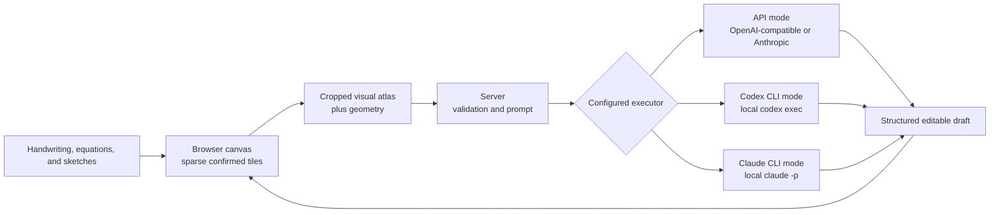

<!-- ZMS-ESTATE:BEGIN -->

Status: Paused.

<!-- ZMS-ESTATE:END -->

<h1 align="center">ZMS Canvas</h1>

<p align="center"><strong>Keep the work when a save fails.</strong></p>

<p align="center">
  
</p>

ZMS Canvas is my fork of [PenEcho](https://github.com/penecho/penecho), a browser canvas where you write or sketch a problem and an AI model answers beside your marks. The PenEcho authors built the canvas. From "Think on the canvas" on, most of this README is adapted from theirs, and the parts about this fork say so. The fork has its own name because PenEcho's [trademark policy](TRADEMARKS.md) requires publicly distributed modified versions to use a distinct name and visual identity.

I wanted a canvas saved on one device to open on another, without losing work to a failed save or a conflicting revision, so the fork adds synchronized notebooks. AI tools write the code. I decide what each project is for and check what comes back.

Pending edits are kept until the server confirms the save. If the save fails, the edits stay available to recover. If a newer version is already on the server, your pending edits go into a separate copy, so both versions are kept.

## What this fork adds

- Synchronized notebooks, off by default. The code is in `notebook-store.js`, `notebook-api.js` and `public/notebooks.js`, and the four `test/notebook-*.test.js` files hold 62 tests.
- Security fixes from [pull request #2](https://github.com/ZMS-Labs/zms-canvas/pull/2) for three problems: a text pattern that crafted input could slow down badly, file checks that could race with changes to the file, and an optional debug file that an unusually large model response could fill, which is now capped.
- Its own CI and a container build, described in the [Actions guide](docs/actions-tier.md).

On 20 September 2026, [CI ran the full suite of 176 tests](https://github.com/ZMS-Labs/zms-canvas/actions/runs/35511370823), and all of them passed. The [repository guide](docs/README.md) covers scope, source setup and verification.

## Think on the canvas

Put a question, equation, diagram, or half-formed idea anywhere on the canvas and pause. It reads your marks and their spatial relationships, then answers beside them. You can work through a problem without translating every step into a chat message or rebuilding it with rigid diagram tools.

- Get answers, hints, explanations, continuations, formulas, plots, and diagrams directly on the canvas.
- Move, resize, accept, or discard every AI draft before it becomes part of your work.
- Draw naturally with a stylus or mouse, then pan and zoom across a sparse `20,000 x 20,000` canvas.
- Draw a freehand lasso around confirmed ink to move, resize, or recolor it locally; accepting or cancelling a selection never triggers an AI request.
- Choose Arcane, Sci-fi, or Research mode to match the kind of problem you are exploring.
- Save lightweight snapshots locally in your browser. Starting a new canvas can overwrite the current snapshot, save a new copy, or continue without saving; unconfirmed AI drafts are never included.
- Export confirmed canvas ink as a cropped PNG with one `512`-pixel tile of paper margin on every side.
- Use the interface in English or Chinese.

The canvas keeps a small local runtime and only allocates `512 x 512` tiles where there is ink, so the huge canvas does not turn into one huge bitmap.

## How it works


```mermaid
flowchart LR
  User["Handwriting, equations, and sketches"] --> Canvas["Browser canvas<br/>sparse confirmed tiles"]
  Canvas --> Atlas["Cropped visual atlas<br/>plus geometry"]
  Atlas --> Server["Server<br/>validation and prompt"]
  Server --> Executor{"Configured executor"}
  Executor --> API["API mode<br/>OpenAI-compatible or Anthropic"]
  Executor --> Codex["Codex CLI mode<br/>local codex exec"]
  Executor --> Claude["Claude CLI mode<br/>local claude -p"]
  API --> Draft["Structured editable draft"]
  Codex --> Draft
  Claude --> Draft
  Draft --> Canvas
```

The browser sends only the relevant canvas crop and geometry. The server validates the request, uses the selected executor, and returns a movable draft that stays separate from confirmed ink until you accept it.

## Quick start

You need [Node.js 22.13+](https://nodejs.org/) and one of the following: an API key, an authenticated [Codex CLI](https://developers.openai.com/codex/cli), or an authenticated [Claude Code CLI](https://code.claude.com/docs/en/overview).

```bash
git clone https://github.com/ZMS-Labs/zms-canvas.git
cd zms-canvas
npm ci
node cli.js configure
node cli.js
```

Open [http://localhost:3888](http://localhost:3888). Other devices on the same trusted LAN can use `http://<this-computer-LAN-IP>:3888`.

This fork has no npm package or GitHub release, so these steps run the code in this checkout, with no separate build step. To get a `zms-canvas` command, run `npm link` after `npm ci`. The examples below use that command.

`node cli.js configure` opens the interactive configuration center. Its main menu contains `LLM source`, `Settings`, and `Exit`. Use the arrow keys and Enter to navigate:

- `LLM source -> Claude CLI` selects a detected, recommended, default, or manually entered model and an effort level. Opus 4.8 or newer is recommended; Sonnet and Opus 4.6 can respond but may produce weaker canvas results.
- `LLM source -> Codex CLI` selects a model and effort. GPT-5.5 or newer is required for good results, `gpt-5.6-sol` is recommended, and `xhigh` is the highest listed Codex effort.
- `LLM source -> API` selects the OpenAI-compatible or Anthropic/Claude-compatible request format, then asks for the URL, model, effort, and hidden key. Anthropic API offers `none` to disable thinking and defaults new configurations to the recommended `medium` adaptive-thinking level. Existing values are offered as defaults and a blank key keeps the saved key.
- `Settings` controls the unified model timeout, the image format sent to every model executor, request recording and retention, listening interface and port, and initial Auto AI delay. WebP is the default; PNG is also available. The delay can also be changed on the canvas.

Every LLM page ends with `Test & Save`, and the configuration center always saves before checking. Codex CLI uses a fast offline check: it verifies the executable and login, then reads `codex debug models --bundled` to confirm the selected model exists. It does not run inference, attach an image, refresh the online catalog, or consume model tokens. Claude CLI and API configuration still send one small real request to verify the selected endpoint/model settings. Whether a check passes or fails, the configuration remains saved and the UI returns to the parent menu with a clear diagnostic.

The canvas toolbar exposes a fixed-width clickable `Reasoning` menu beside Auto AI for frequent per-request changes: `Configured`, `none`, `low`, `medium`, `high`, and the provider's highest practical level. `Configured` omits the per-request effort field so the server preserves the configured custom effort or the underlying CLI default. The last explicit position maps to `xhigh` for OpenAI API and Codex CLI, and to `max` for Anthropic API and Claude CLI. `none` sends OpenAI `reasoning_effort=none`; for Claude it disables thinking. Model support remains provider-dependent, so an endpoint may reject a level its selected model does not implement. The saved `AI_EFFORT` initializes this control, while a toolbar change overrides it for subsequent canvas requests without rewriting the configuration file. The menu closes after a selection or five seconds of inactivity.

The default configuration is `~/.zms-canvas/config.env`. API credentials are plaintext in this local file, receive owner-only permissions on POSIX systems, and are never sent to browser code. Protect it like any other credential. If `zms-canvas` is started before this file exists, it opens the configuration center automatically in an interactive terminal.

Use a different env-style configuration file for a particular launch when needed:

```bash
zms-canvas configure --config ./team.env
zms-canvas --config ./team.env
```

An explicit `--config` file replaces the default global file for that command. The app does not automatically read a project-directory `.env` or a package-directory `.env`.

### CLI prerequisites

Installing the Codex desktop app alone does not guarantee that a `codex` executable is available on the shell `PATH`. Install and authenticate the CLI separately before selecting Codex:

```bash
npm install -g @openai/codex@latest
hash -r
codex --version
codex login status
```

If needed, run `codex login`. Claude CLI mode similarly requires an installed and authenticated Claude Code CLI, normally through `claude auth login`.

CLI mode runs the selected CLI locally and does not need an API key for that source. Normal startup checks the executable and login without consuming model tokens.

Canvas requests through Codex use `codex exec --json`. The server returns as soon as Codex emits the final agent message and `turn.completed`; if the CLI process remains alive afterward, it is terminated and cleaned up in the background instead of delaying the canvas response.

Claude CLI requests use one isolated `claude -p` turn with tools, agents, MCP, prompt suggestions, session persistence, and other nonessential background traffic disabled. Selecting effort `none` sets `MAX_THINKING_TOKENS=0`, causing Claude Code to send `thinking.type=disabled`; because `none` is not a valid Claude CLI effort value, the server also passes an internal `low` effort and per-process `--settings` override to neutralize any user-level `CLAUDE_CODE_EFFORT_LEVEL=max`. Selecting `low`, `medium`, `high`, or `max` leaves thinking enabled and applies the chosen value through both Claude's `--effort` flag and the same settings override. The server incrementally validates the stream and returns as soon as Claude emits its successful final `result`; any attempted tool use aborts the request, while a CLI process that remains alive after the result is terminated and cleaned up in the background.

Transient launch overrides remain available:

```bash
zms-canvas doctor --codex
zms-canvas --codex --model gpt-5.6-sol --effort xhigh
zms-canvas --claude --model opus --effort max
zms-canvas --port 4000
```

`--model`, `--effort`, and `--port` apply only to that process and take precedence over the selected configuration file. Omit them to use the saved choice or the underlying CLI default. Other model-specific effort strings are accepted and passed through.

### Run it in a container

The fork's [Dockerfile](Dockerfile) builds an image that runs as a non-root user (UID and GID `1000`), with labels that point to this source and the AGPL license. Build it from this checkout:

```bash
docker build -t zms-canvas:local .
```

Mount a writable directory at `/state`. The image keeps its state there, including notebooks at `/state/notebooks.sqlite`, so the data lives outside the image. Never copy configuration files, credentials, logs, SQLite files or notebook data into the build context. The image starts through the package CLI, so it needs a complete AI configuration at run time.

Synchronized notebooks stay disabled unless `PENECHO_NOTEBOOKS_ENABLED=true` is set, and the example below leaves them off. They need a sign-in proxy in front of the server, so read the [notebook settings](#synchronized-notebooks) before you turn them on.

Create an env file outside this repository and put a real credential in it:

```env
AI_PROVIDER=api
AI_API_URL=https://api.openai.com/v1
AI_API_MODEL=gpt-5.6-terra
AI_API_KEY=<real runtime credential>
PENECHO_NOTEBOOKS_ENABLED=false
```

Then start the container:

```bash
docker run --rm -p 3888:3888 \
  -v zms-canvas-state:/state \
  --env-file /secure/zms-canvas.env \
  zms-canvas:local
```

## Recommended model configurations

The recommendations in this section, and the cost figures in the next, are PenEcho's. They were copied from PenEcho's README when this fork was made in July 2026, and that README describes them as coming from hands-on testing, which had not yet covered Google models. PenEcho's [current README](https://github.com/penecho/penecho#recommended-model-configurations) has a newer list. Response times vary with the provider, how complex the canvas is, image size and reasoning level.

| Model | Effort | Quality and speed | Recommended use |
| --- | --- | --- | --- |
| `claude-opus-4-8` | `medium` | Strong quality with a better latency balance | Recommended Opus default for everyday canvas work |
| `claude-opus-4-8` | `high` | Higher reasoning quality, with longer and more variable waits | Complex handwriting, mathematics, diagrams, or layout decisions where quality matters more than speed |
| Fable 5 (`claude-fable-5` or `fable`) | `medium` | Very good results; in PenEcho's tests, often about half the response time of `gpt-5.6-sol` at `xhigh` | A fast, high-quality general-purpose choice |
| `gpt-5.6-terra` | `low` to `high` | Surprisingly strong and responsive; in PenEcho's tests it did better than `gpt-5.6-sol` and answered quickly | Recommended OpenAI option across a flexible range of quality and latency targets |
| `gpt-5.6-luna` | `xhigh` | Very good canvas results with strong response speed | A responsive quality-first option when `xhigh` reasoning is appropriate |
| `gpt-5.6-sol` | `high` | Good enough for most requests and more responsive than `xhigh` | Recommended Sol default when responsiveness matters |
| `gpt-5.6-sol` | `xhigh` | Very good results, but slower and more variable | Quality-first Sol configuration for difficult canvas tasks |

## Token use and cost

For a typical request, total output tokens, including hidden reasoning tokens when the provider reports them, roughly follow the effort level:

| Effort | Typical output usage | Practical guidance |
| --- | --- | --- |
| `low` | Around `1,000` tokens | Usually enough for most everyday canvas requests |
| `medium` | Around `3,000` tokens | More reasoning headroom for recognition, mathematics, diagrams, and layout |
| `xhigh` or `max` | Around `5,000` to `8,000` tokens | Common for quality-first `gpt-5.6-sol` and other maximum-effort requests; expect higher latency and cost |

These are rough estimates, not limits the app enforces. The cost example below uses the typical `low` case: `10,000` input tokens and `1,000` output tokens. At the short-context API rates listed in July 2026, that would be:

- `gpt-5.6-sol`: `10,000 x $5.00 / 1M + 1,000 x $30.00 / 1M = $0.080`
- `gpt-5.6-terra`: `10,000 x $2.50 / 1M + 1,000 x $15.00 / 1M = $0.040`
- `gpt-5.6-luna`: `10,000 x $1.00 / 1M + 1,000 x $6.00 / 1M = $0.016`

Medium, `xhigh`, and `max` requests can cost more because their reasoning tokens are billed as output. Prices change, so check [OpenAI API pricing](https://developers.openai.com/api/docs/pricing) for current rates.

If you sign in to Codex with ChatGPT, Codex CLI mode uses the Codex usage included with your plan instead of an API key. See [Codex pricing](https://learn.chatgpt.com/docs/pricing) for current plans and limits. Claude CLI mode similarly uses the account authenticated by Claude Code; it is distinct from Anthropic API billing.

## Safe deployment

The server listens on `0.0.0.0:3888` by default so localhost and trusted-LAN access work immediately. Choose the deployment boundary that matches your executor:

- Use Codex CLI and Claude CLI modes only on the local machine or a trusted, directly connected LAN. A valid request starts a local CLI process, so do not expose either mode directly to the public internet or an untrusted reverse proxy. Both work immediately from localhost and LAN addresses without a public-origin setting. Before it launches the selected CLI, the server checks the Host, the client network, the exact Origin, a session cookie that lasts as long as the process, and the JSON content type. Each valid new request immediately supersedes the prior request; it never waits in a queue or returns a busy response.
- API mode intentionally accepts local, LAN, proxy, and remote requests without app-level Host or Origin restrictions. If you expose it publicly, place it behind HTTPS, authentication, rate limiting, and request-size controls. Keep the selected configuration file and provider keys private; credentials remain in the Node.js process and are never sent to browser code.

For either mode, keep debug artifacts and request tracing disabled in production unless you are actively diagnosing a problem, and never publish configuration files, logs, screenshots, or saved requests containing private content. When request recording is enabled in `Settings`, each valid AI request is stored under `~/.zms-canvas/logs/requests` by default, including the source `atlas.png`, the outbound image, credential-redacted request body, raw and parsed responses, fallback details, and final status. The UI also displays this path and configures retention.

## Useful configuration

The configuration center writes these settings to `~/.zms-canvas/config.env`, or to the file selected with `--config`:

| Setting | Purpose |
| --- | --- |
| `AI_PROVIDER` | Executor: `api`, `codex-cli`, or `claude-cli` |
| `AI_API_FORMAT` | API request format: `openai` (default example) or `anthropic` |
| `AI_API_URL` / `AI_API_KEY` | API endpoint and credential; used only in API mode |
| `AI_API_MODEL` | Model used in API mode |
| `AI_EFFORT` | Starting effort for the toolbar's `Reasoning` menu. Leave it empty to use the CLI's default. `none` turns reasoning off where the provider supports it, and custom effort names are passed through as written. A toolbar choice overrides it for later requests without editing the file |
| `AI_TIMEOUT_SECONDS` | Unified timeout for API, Codex CLI, and Claude CLI model attempts; default 180, allowed range 10 to 600 |
| `PENECHO_AI_IMAGE_FORMAT` | Image format sent to API, Codex CLI, and Claude CLI: `webp` (default) or `png` |
| `CODEX_CLI_MODEL` | Optional model override for Codex CLI mode |
| `CLAUDE_CLI_MODEL` | Optional alias or model-ID override for Claude CLI mode |
| `AUTO_AI_DELAY_SECONDS` | Initial delay before automatic recognition; the browser control can override it from 0 to 10 seconds |
| `PENECHO_REQUEST_TRACE` | Save local per-request image, outbound request, response, and outcome traces; disabled by default |
| `PENECHO_REQUEST_TRACE_LIMIT` | Number of local request traces retained, default 100 and maximum 1000 |
| `HOST` / `PORT` | Listening interface and port, default `0.0.0.0:3888` |

For installed CLI starts, `--model` overrides the selected executor's model setting and `--effort` overrides `AI_EFFORT` for that process only. Command-line options and process environment variables take precedence over the selected configuration file.

Several settings keep PenEcho's `PENECHO_` prefix, so settings written for PenEcho are still accepted: `PENECHO_STATE_DIR`, `PENECHO_AI_IMAGE_FORMAT`, `PENECHO_REQUEST_TRACE` and `PENECHO_REQUEST_TRACE_LIMIT`.

Run the checks before submitting a change:

```bash
npm run check
```

For implementation details, see the [architecture notes](docs/architecture.md).

### Synchronized notebooks

This fork added three notebook settings. They use the same `PENECHO_` prefix, but they did not exist in PenEcho. The configuration center does not write them; set them in the configuration file or as environment variables.

Notebooks are off unless you turn them on. Turn them on only when a sign-in proxy that sets the owner header is the only way to reach the server, because the server takes that header at its word.

| Setting | Purpose |
| --- | --- |
| `PENECHO_NOTEBOOKS_ENABLED` | Turns on synchronized notebooks when set to `true`; off by default |
| `PENECHO_NOTEBOOKS_OWNER_HEADER` | Name of the request header that carries the signed-in person's ID; set it to the header your sign-in proxy sets. If it is unset or empty, the server falls back to a built-in header name, so always set it, and make sure the proxy replaces any copy of that header a client sends |
| `PENECHO_NOTEBOOKS_DB` | Notebook database file; default `notebooks.sqlite` in the state directory (`~/.zms-canvas` from source, `/state` in the container) |

## Questions and feedback

Issues and discussions are turned off on this fork. Questions and conversations are welcome through [my GitHub profile](https://github.com/SternOne). For the canvas itself, PenEcho's own [issues](https://github.com/penecho/penecho/issues), [discussions](https://github.com/penecho/penecho/discussions) and [Discord](https://discord.gg/3jrPJ3mXdX) are the right place. Before opening a pull request here, read [CONTRIBUTING.md](CONTRIBUTING.md).

## License and attribution

ZMS Canvas is open source under [GNU AGPL v3.0 only](LICENSE), the same license as PenEcho, and it keeps PenEcho's copyright, license and notices (see [NOTICE](NOTICE)). Commercial use is allowed under the AGPL. If you modify it and provide that version to users over a network, you must offer those users the corresponding source code.

The terms that pair the AGPL with separate commercial licenses are PenEcho's. [COMMERCIAL-LICENSE.md](COMMERCIAL-LICENSE.md) describes commercial licenses for PenEcho, negotiated with the applicable PenEcho copyright holder, and the [contributor agreement](CONTRIBUTOR-LICENSE-AGREEMENT.md) covers contributions to PenEcho itself.

The PenEcho name, logo and related brand assets remain the property of their owners and are not granted for general use under the software license; see [TRADEMARKS.md](TRADEMARKS.md).
